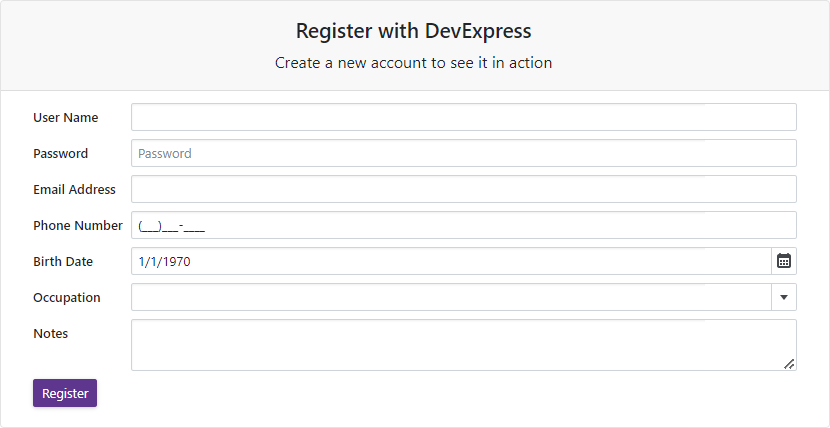

<!-- default badges list -->

<!-- default badges end -->
# Blazor Editors - How to create editors dynamically according to the EditForm's model

This example illustrates how to add the [Form Layout](https://docs.devexpress.com/Blazor/401181/navigation-and-layout#form-layout) component to an [EditForm](https://learn.microsoft.com/en-us/dotnet/api/microsoft.aspnetcore.components.forms.editform?view=aspnetcore-7.0) at runtime. The Form Layout component is populated with [DevExpress Data Editors](https://docs.devexpress.com/Blazor/401156/data-editors) dynamically according to the EditForm's model.

## Files to Review

* [UserData.cs](./CS/DxBlazorApplication1/Data/UserData.cs)
* [Index.razor](./CS/DxBlazorApplication1/Pages/Index.razor)

## Documentation

* [DevExpress Blazor Components](https://docs.devexpress.com/Blazor/400725/blazor-components)
